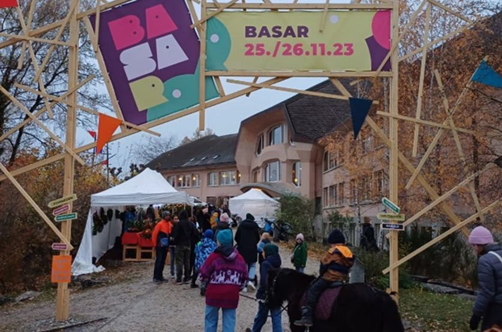

+++
title = "Basar, Bildung ,Gemeinschaft: Die einzigartige Welt der Rudolf Steiner Schule"
date = "2024-02-25"
draft = false
pinned = false
tags = ["SteinerSchule", "Pädagogik", "Basar"]
image = "basar-bild-1_compressed.png"
description = "Einmal im Jahr öffnet die Rudolf Steiner Schule in Ittigen ihre Tore für den viel erwarteten Steiner Schul-Basar. Ein bunter Marktplatz der Kreativität, der nicht nur ein Schaufenster für Kunsthandwerk und kulinarische Köstlichkeiten bietet, sondern auch Einblicke in die einzigartige pädagogische Philosophie dieser alternativen Bildungseinrichtung gewährt. Im Mittelpunkt des Schulalltags steht ein Streben nach Einklang und Ganzheit von Seele, Geist und Körper. Durch rhythmisches Tanzen, farbenfrohes Gestalten und Zeit in der Natur wird auf diese Ziele hingesteuert. Dahinter steckt traditionsreiche Pädagogik, Gemeinschaft und Herzblut. "
+++


Einmal im Jahr öffnet die Rudolf Steiner Schule in Ittigen ihre Tore für den viel erwarteten Steiner Schul-Basar. Ein bunter Marktplatz der Kreativität, der nicht nur ein Schaufenster für Kunsthandwerk und kulinarische Köstlichkeiten bietet, sondern auch Einblicke in die einzigartige pädagogische Philosophie dieser alternativen Bildungseinrichtung gewährt. Im Mittelpunkt des Schulalltags steht ein Streben nach Einklang und Ganzheit von Seele, Geist und Körper. Durch rhythmisches Tanzen, farbenfrohes Gestalten und Zeit in der Natur wird auf diese Ziele hingesteuert. Dahinter steckt traditionsreiche Pädagogik, Gemeinschaft und Herzblut. 

Rahel Krebs, Lina Britschgi 



Vor dem hölzernen Eingangsbogen des alljährlichen Rudolf Steiner Schul-Basars liegt ein esoterischer Duft, der von verschiedenen Essensgerüchen durchbrochen wird, in der kalten Luft. Zwei Schritte unter dem Bogen durch und schon ist man mitten im Geschehen. Essensstände zur Linken und Rechten, spielende Kinder in einem abgesperrten Bereich auf Vehikeln aller Art. Der Blick wandert über das Geschehen und bleibt bei den Eingangstoren des imposanten Gebäudes stehen. Es ähnelt der ersten Schule ihrer Art, Fenster mit runden Ecken im Zusammenspiel mit untypischen Winkeln in der Fassade. 1919 entwarf Rudolf Steiner die erste Waldorf Schule, der Auftrag kam von Emil Molt, Besitzer der damaligen Waldorf Astoria Zigarettenfabrik. Die Vision war eine Bildung nach dem Prinzip der sozialen Gerechtigkeit. Bis heute blieb man dieser Vision treu.

Um mehr über diese besondere Bildungsphilosophie zu erfahren, gibt es nur einen Weg: Ein letzter Blick auf das heitere Treiben und dann ab durch die Tür. Menschen, wo hin das Auge reicht. Stimmengewirr dröhnend in den Ohren. Wenige Augenblicke vergehen, die Sinne gewöhnen sich. Orientierung verschaffen und rein ins Getümmel.  Im Parterre unterscheidet sich das Angebot von Schulzimmer zu Schulzimmer. Von Schmuck, Kristallen, Kleidung, über Postkarten, Bilder, Holzfiguren bis zu Pflegeprodukten und Kerzen gibt es alles. Etwas fällt auf, das meiste ist in einem ähnlichen handgemachten Stil. Alles wirkt etwas alternativ; fremd denen, welche gewöhnliche Schulanlässe gewohnt sind. Im Untergeschoss sind Kinder bei verschiedensten Aktivitäten zu sehen. Die einen dekorieren Lebkuchen, die anderen ziehen Kerzen. Im Zimmer vis-à-vis sind die Klänge eines kleinen Konzerts mit Akkordeon zu vernehmen.

<!--StartFragment-->

**Die Pädagogik hinter der Rudolf Steiner Schule**

<!--EndFragment-->

Dies ist die Überschrift 2 (H2).

### Überschrift 3

Die Überschrift 3 ist nicht mehr im Menu verfügbar. Wenn man sie verwenden will, muss man in den `Markdown`-Modus wechseln und dort eine Überschrift mit drei Hastags einleiten: `### Überschrift 3`

#### Überschrift 4

Auch Überschrift 4 muss im `Markdown`-Modus erstellt werden: `#### Überschrift 4`

## Weitere Textformatierungen

Am besten einfach alle Formatierungsmöglichkeiten in der Toolbar von `Inhalt` mal ausprobieren.

### Fett und Kursiv

Natürlich gibt es auch **fett** und *kursiv*.

### Links

[So können Links angegeben werden](https://www.lilo.blog). Wenn man in den `Markdown`-Modus wechselt, sieht man auch, welcher Link hinterlegt worden ist.

### Zitate

> «Zitate können hervorgehoben werden.»
>
> *Autor mit [Link zur Quelle](https://www.lilo.blog)*

Die Quellenangabe muss *kursiv* geschrieben werden, damit sie als Fusszeile erkannt wird.

### Liste