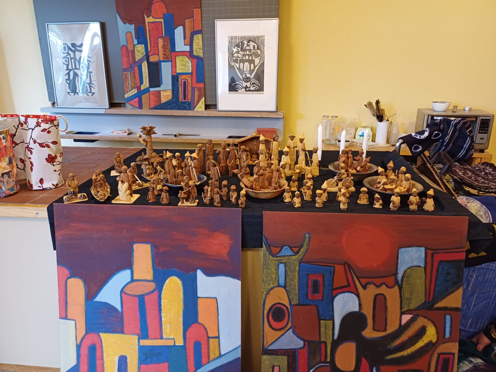

+++
title = "Basar, Bildung ,Gemeinschaft: Die einzigartige Welt der Rudolf Steiner Schule"
date = "2024-02-25"
draft = false
pinned = false
tags = ["SteinerSchule", "Pädagogik", "Basar"]
image = "basar-bild-1_compressed.png"
description = "Einmal im Jahr öffnet die Rudolf Steiner Schule in Ittigen ihre Tore für den viel erwarteten Steiner Schul-Basar. Ein bunter Marktplatz der Kreativität, der nicht nur ein Schaufenster für Kunsthandwerk und kulinarische Köstlichkeiten bietet, sondern auch Einblicke in die einzigartige pädagogische Philosophie dieser alternativen Bildungseinrichtung gewährt. Im Mittelpunkt des Schulalltags steht ein Streben nach Einklang und Ganzheit von Seele, Geist und Körper. Durch rhythmisches Tanzen, farbenfrohes Gestalten und Zeit in der Natur wird auf diese Ziele hingesteuert. Dahinter steckt traditionsreiche Pädagogik, Gemeinschaft und Herzblut. "
+++


Einmal im Jahr öffnet die Rudolf Steiner Schule in Ittigen ihre Tore für den viel erwarteten Steiner Schul-Basar. Ein bunter Marktplatz der Kreativität, der nicht nur ein Schaufenster für Kunsthandwerk und kulinarische Köstlichkeiten bietet, sondern auch Einblicke in die einzigartige pädagogische Philosophie dieser alternativen Bildungseinrichtung gewährt. Im Mittelpunkt des Schulalltags steht ein Streben nach Einklang und Ganzheit von Seele, Geist und Körper. Durch rhythmisches Tanzen, farbenfrohes Gestalten und Zeit in der Natur wird auf diese Ziele hingesteuert. Dahinter steckt traditionsreiche Pädagogik, Gemeinschaft und Herzblut. 

Rahel Krebs, Lina Britschgi 



Vor dem hölzernen Eingangsbogen des alljährlichen Rudolf Steiner Schul-Basars liegt ein esoterischer Duft, der von verschiedenen Essensgerüchen durchbrochen wird, in der kalten Luft. Zwei Schritte unter dem Bogen durch und schon ist man mitten im Geschehen. Essensstände zur Linken und Rechten, spielende Kinder in einem abgesperrten Bereich auf Vehikeln aller Art. Der Blick wandert über das Geschehen und bleibt bei den Eingangstoren des imposanten Gebäudes stehen. Es ähnelt der ersten Schule ihrer Art, Fenster mit runden Ecken im Zusammenspiel mit untypischen Winkeln in der Fassade. 1919 entwarf Rudolf Steiner die erste Waldorf Schule, der Auftrag kam von Emil Molt, Besitzer der damaligen Waldorf Astoria Zigarettenfabrik. Die Vision war eine Bildung nach dem Prinzip der sozialen Gerechtigkeit. Bis heute blieb man dieser Vision treu.

Um mehr über diese besondere Bildungsphilosophie zu erfahren, gibt es nur einen Weg: Ein letzter Blick auf das heitere Treiben und dann ab durch die Tür. Menschen, wo hin das Auge reicht. Stimmengewirr dröhnend in den Ohren. Wenige Augenblicke vergehen, die Sinne gewöhnen sich. Orientierung verschaffen und rein ins Getümmel.  Im Parterre unterscheidet sich das Angebot von Schulzimmer zu Schulzimmer. Von Schmuck, Kristallen, Kleidung, über Postkarten, Bilder, Holzfiguren bis zu Pflegeprodukten und Kerzen gibt es alles. Etwas fällt auf, das meiste ist in einem ähnlichen handgemachten Stil. Alles wirkt etwas alternativ; fremd denen, welche gewöhnliche Schulanlässe gewohnt sind. Im Untergeschoss sind Kinder bei verschiedensten Aktivitäten zu sehen. Die einen dekorieren Lebkuchen, die anderen ziehen Kerzen. Im Zimmer vis-à-vis sind die Klänge eines kleinen Konzerts mit Akkordeon zu vernehmen.

### **Die Pädagogik hinter der Rudolf Steiner Schule**

Die Atmosphäre an der Rudolf Steiner Schule zeichnet sich durch Kreativität und Individualität aus. Dies wird beim Durchschlendern des Basars deutlich spürbar. Hier liegt der Fokus auf der natürlichen Entwicklung des Kindes. Lehrpläne unterscheiden sich in grossen Teilen von den herkömmlichen. Sie sind nicht durchstrukturiert, sondern dienen nur als grober Richtwert. Der Unterricht wird in Epochen gestaltet, was bedeutet, dass sich die Schüler*innen für längere Zeit auf ein bestimmtes Fach konzentrieren. Dies ermöglicht ein tieferes Eintauchen in das Thema. Denn in Unterrichtseinheiten gilt Qualität vor Quantität. Es wird weniger Stoff behandelt, jedoch wird das Wissen viel intensiver und tiefer vermittelt, um Informationen langfristig zu lehren. Danach kann man die «Wissenslücken» einfach füllen, da man das grosse Ganze verstanden und noch präsent hat, so zumindest laut Herr Florian Furrer, Lehrer an der Rudolf Steiner Schule Ittigen und Standortleitung dieser Schule. 

Die Lehrer\*innen an Rudolf Steiner Schulen spielen eine zentrale Rolle, denn sie entscheiden oftmals, wie intensiv und auf welche Art Unterrichtsthemen behandelt werden. Zudem behält eine Klasse bis zu acht Jahren die gleiche Lehrperson. Dies liegt daran, dass die Gründung der Schule in die Nachkriegszeit des ersten Weltkriegs fiel. In vielen Haushalten fehlten Vaterfiguren und damit eine Bezugsperson. Daher wurde Wert auf konstante Beziehungen zu den Pädagog\*innen gelegt.

Ein Markenzeichen dieser Schulen ist die Einführung von Eurythmie, einer einzigartigen Bewegungskunst, welche die harmonische Entwicklung des Menschen unterstützen soll. Die Förderung des Gleichgewichts und der Stabilität soll eine heilende Wirkung haben. In den Unterrichtseinheiten wird viel mit Bewegung und räumlichem Vorstellungsvermögen gearbeitet. Laut Herr Florian Furrer werden sich die Kinder ihrer eigenen Existenz im Raum bewusst und können sich darin ausprobieren.

Das Leitbild der Rudolf Steiner Schulen stützt sich auf den Glauben an die Gemeinschaft. Das Ziel ist es, dem einzelnen zu seinem Besten zu verhelfen aber ebenso ihn seinen Platz in der Gemeinschaft finden zu lassen. Die Schule unternimmt zahlreiche Aktivitäten zur Stärkung der Gemeinschaft, beispielsweise diesen Basar.

> *«Der Basar soll Gemeinschaft, Pflege und Hauswirtschaft fördern. Aber auch das
> Gemeinschaftsgefühl und die Kultur sollen gestärkt werden. Die Kinder sollen realisieren,
> dass sie die Schule sind.»* (Florian Furrer, 25.11.2023)

### Diese Philosophie stösst auch auf Kritik

Heutzutage kritisieren einige dieses Lernmodel, da es angeblich für die Kinder nicht fördernd sei,
wenn sie eine zu starke emotionale Bindung zu einer Lehrperson hätten. Ausserdem sei es fast
unverantwortbar zu erwarten, dass eine Lehrperson sich das Wissen für acht Schuljahre souverän
aneignen und weitergeben könne. Auf den zweiten Kritikpunkt treten einige Schulen ein und lassen
die Lehrpersonen drei bis sechs Jahre bei der gleichen Klasse und nicht acht, so auch die Rudolf
Steiner Schule in Ittigen. 
Ebenfalls bemängelt werden Eurythmie und der grosse Anteil an Kunst- und Handarbeitsfächern.
Kritiker sind der Meinung, dass dies die Kinder nicht weiterbringe, sondern pure Zeitverschwendung
sei. Die Pädagogik hinter der Steiner Schule legt jedoch expliziten Wert darauf, denn dies soll die
Selbstverwirklichung und Entfaltung der Kinder fördern. 
Aussenstehende bringen auch Kritik an der Gemeinschaft an, denn die Rudolf Steiner Schule wirke
abgeschlossen von der Aussenwelt, und dies würde den Kindern mögliche alternative Perspektiven
verwehren und einen gewissen Grad an Homogenität entstehen lassen. Einer der grössten
Kritikpunkte im digitalen Zeitalter ist der fehlende Umgang mit neuen Medien. Dies räumt Herr Furrer
ebenfalls ein: „Im Vergleich zu staatlichen Schulen haben wir punkto digitaler Medien aber noch viel
aufzuholen.“
Trotz der Kritikpunkte gibt es viele Eltern, welche den Fokus auf persönliche Entfaltung und kreative
Verwirklichung schätzen und gerade deswegen die Rudolf Steiner Schule für ihre Kinder wählen. Die
Debatte über diesen alternativen Bildungsweg wird weithin kontrovers geführt. Diskussionspunkte

sind, ob die Rudolf Steiner Schule tatsächlich einen Weg zu einer ganzheitlichen Bildung darstellt und
ob sie den Anforderungen der modernen Welt ausreichend gerecht werden kann.

> *«Ich hoffe, dass zukünftig mehr Vertrauen in die Schule gelegt
> wird. Sie soll weniger stigmatisiert und ohne Vorurteile
> betrachtet werden.»* (Florian Furrer, 25.11.2023)

### Die Pädagogik spürbar am Basar

In den Theatersälen, welche das gleiche architektonische Muster aufweisen, wie der Rest des
Gebäudes, sind Kurzauftritte von Schüler*innen der Schule zu sehen. Beim Betrachten dieser
Darbietungen ist zu erkennen, dass diese hervorragend strukturiert sind und authentisch wirken. Die
Kinder entfalten auf dieser Bühne förmlich ihr Inneres, sie drücken Einklang zwischen Geist, Körper
und Seele aus und verzaubern die Menschenmassen. Die Auftritte gehen zu Ende und der Applaus
beginnt zu toben. Die Menschen erheben sich und strömen mit heiteren Gesprächen aus dem Saal.
Auf einer Steinbank sitzend, wird das Gehörte und Gesehene eingeordnet und reflektiert. Die
selbstgefertigten Postkarten, Kerzen und der Schmuck, welche auf den Basarständen präsentiert
werden, spiegeln den Fokus auf kreatives Schaffen und Selbstentfaltung wider. Die individuelle
Entwicklung und hauswirtschaftlichen Fähigkeiten werden beim Basar gefördert, da die Kinder die
Stände teils selbst betreiben. Die Schüler*innen sind aktiv in den Organisationsprozess eingebunden,
sei es bei der Auswahl der Produkte, beim Aufbau von Ständen oder bei der Durchführung von
Aktivitäten. Dies spiegelt die Vision wider, dass Bildung ein gemeinschaftlicher Prozess ist, in welchem
Lehrpersonen und Kinder eine gleichwertige Rolle spielen.

Der Basar der Steiner Schule in Ittigen ist somit nicht nur ein Schulanlass für handgemachte Waren,
sondern er gewährt einen Einblick in die Grundprinzipien dieser alternativen Bildungsrichtung.
Individualität, Gemeinschaft und die gelebten Werte der Kreativität, welche im Schulalltag eine
zentrale Rolle spielen, werden hierbei reflektiert und nach außen getragen. Durch Aufführungen wird
das Streben nach Einklang zwischen Geist, Körper und Seele vermittelt. Die Debatte über die
Effektivität dieser alternativen Bildung bleibt ein kontroverses Thema. Die Frage bezüglich ihrer
Anpassungsfähigkeit an moderne Anforderungen ist offen. Schlussendlich ist der Basar ein Fenster,
welches Einblicke hinter die Kulissen ermöglicht, indem die Anthroposophie und ihre Pädagogik
erlebbar gemacht werden.


``

##### Infokasten

Weltweit gibt es, Stand Mai 2020 1214 Steiner- respektive
Waldorfschulen. Die meisten befinden sich im
Gründungsland Deutschland, dort sind es 252 an der Zahl.
In der Schweiz sind es 32 darunter auch die Rudolf Steiner
Schule in Ittigen.

``
